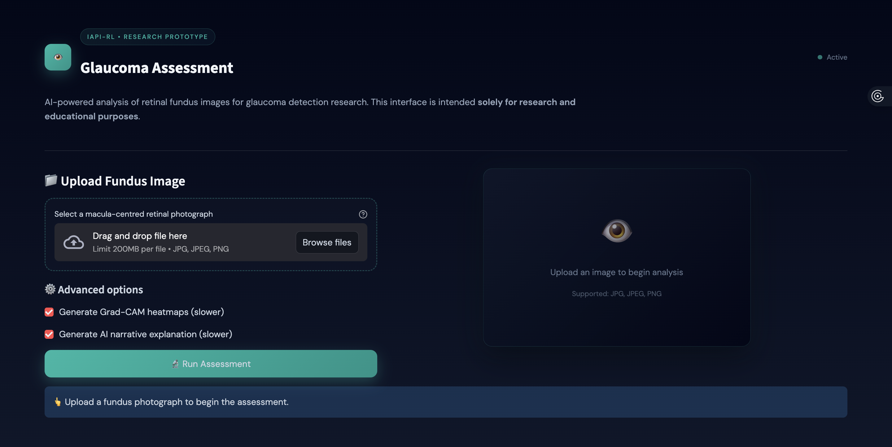
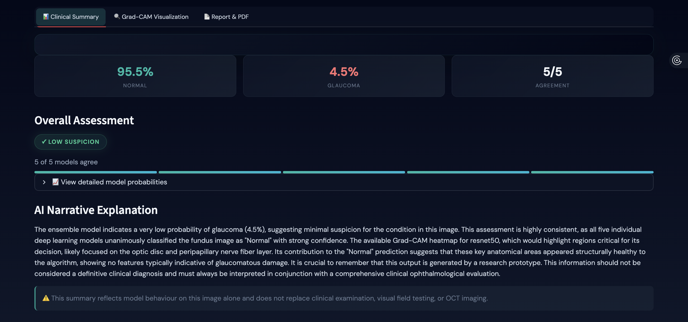
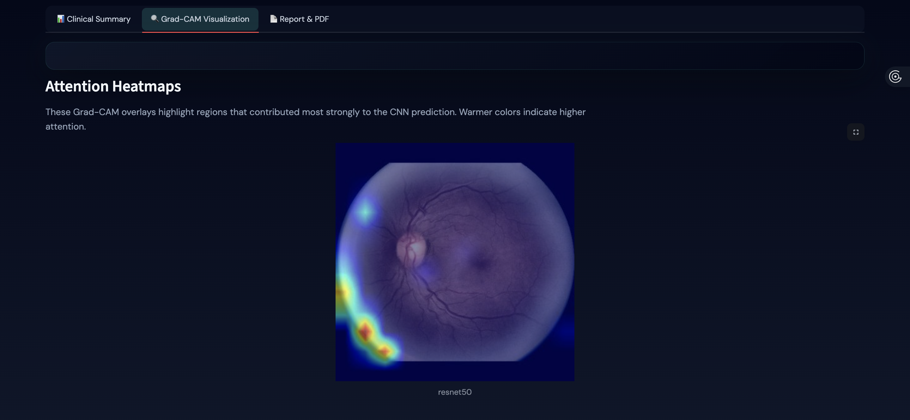
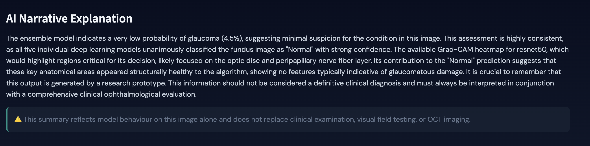
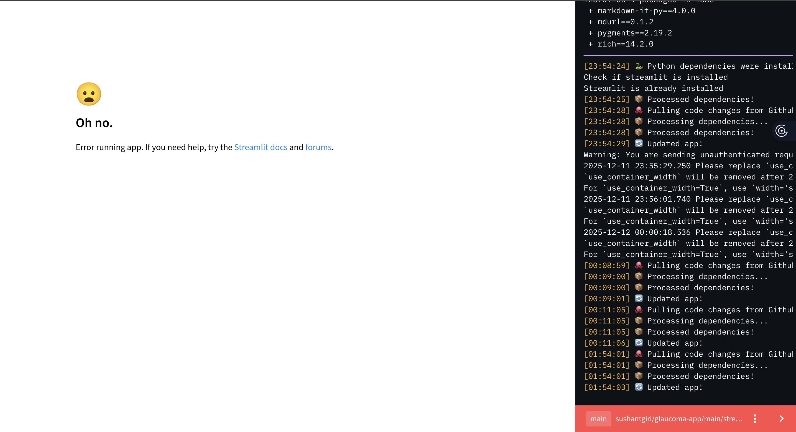
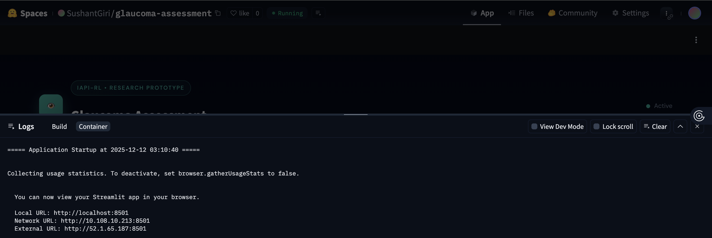
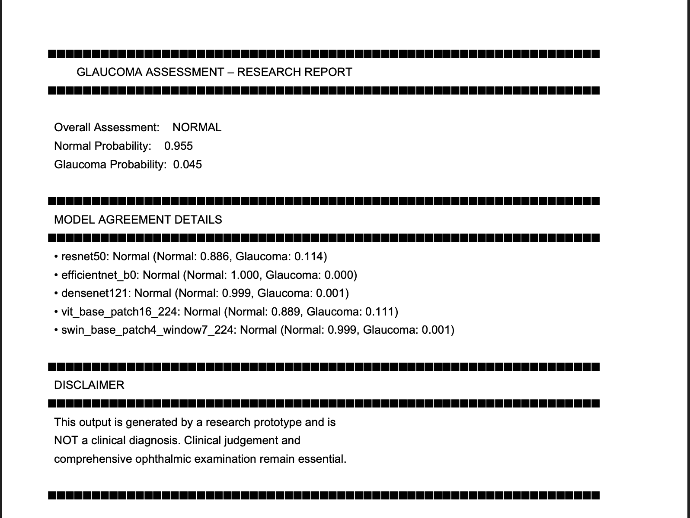

👁️ **Glaucoma Assessment – Research Prototype**

AI-powered retinal fundus analysis using CNN/Transformer ensembles + Grad-CAM + Gemini explanations

<p align="center">
  
</p>

---

## 🔍 App Preview

### **Main Interface**
<p align="center">
  
</p>

### **Prediction + Probability Example**
<p align="center">
  
</p>

### **Grad-CAM Heatmaps**
<p align="center">
  
</p>

### **Narrative Explanation (Gemini)**
<p align="center">
  
</p>

## 🧠 **Project Evolution**

### **1️⃣ Phase 1 — Local Streamlit Prototype (Crashed Due to Heavy Models)**

We started with a full Streamlit UI running locally on a MacBook:

- 5 deep learning models loaded simultaneously  
- Grad-CAM heatmaps  
- Gemini API calls  
- High-resolution fundus images  
- PDF report generation  

#### ❌ Issues Faced
- Streamlit Cloud memory limit exceeded  
- Local CPU extremely slow for transformers  
- Every hot reload reloaded all models → instant crashes  
- Grad-CAM froze the UI  
- Session state kept resetting → blank screen  
- PDF build stalled  

#### 🧪 Screenshot from early debugging
<p align="center">
  
</p>

---

### **2️⃣ Phase 2 — Migration to HuggingFace Spaces (Success 🎉)**

HuggingFace solved all the memory and stability issues:

- Stable container environment  
- Higher RAM  
- Built-in model hosting  
- Secrets management  
- Automatic rebuilds  
- Public shareable interface  

#### ✔ HuggingFace version supports:
- 5-model ensemble inference  
- Grad-CAM generation  
- Gemini narrative explanations  
- PDF export  
- Public demo URL  

#### 📸 Deployment Screenshot
<p align="center">
  
</p>

---

## ⚙️ **Tech Stack**

### **Machine Learning**
| Component | Technology |
|----------|------------|
| DL Framework | PyTorch |
| Models | CNN + Vision Transformers |
| Explainability | Grad-CAM, Attention Rollout |
| Narrative AI | Google Gemini |

### **Frontend / Deployment**
- Streamlit UI  
- Custom dark medical theme (CSS-styled)  
- Hosted on HuggingFace Spaces  

---

## 📁 **Repository Structure**

```
glaucoma-assessment/
│
├── backend/
│   ├── inference_core.py         # Ensemble loader + prediction logic
│   ├── gemini_explainer.py       # Gemini VLM narrative generator
│
├── models/                       # .pth model weights
│
├── gradcams/                     # Generated GradCAM images
│
├── images/                       # Screenshots for README
│
├── streamlit_app.py              # Main Streamlit UI
├── app.py                        # HuggingFace entrypoint wrapper
├── requirements.txt              # Dependencies
└── README.md
```

---

## 🎯 **Live Demo**
🔗 Public HuggingFace URL:  
👉 [https://huggingface.co/spaces/SushantGiri/glaucoma-assessment](https://SushantGiri-glaucoma-assessment.hf.space)

---

## ▶️ **Local Installation (Optional – Heavy)**

```
git clone https://github.com/yourusername/glaucoma-assessment
cd glaucoma-assessment

pip install -r requirements.txt
streamlit run streamlit_app.py
```

⚠️ Requires at least **8–12GB RAM** for 5-model ensemble.

---

## 📄 **Sample PDF Output**
<p align="center">
  
</p>

---

## ⚠️ **Disclaimer**

This project is a research prototype and **not a medical diagnostic tool**.  
Do not use it for clinical decisions.

---

## 🙏 **Credits**
- Lakehead University — IAPI-RL Lab  
- HuggingFace Spaces  
- Google Gemini  
- PyTorch + Timm  

---

## 📬 **Contact**
**Sushant Giri**  
Senior Mobile App Developer • AI/ML Researcher  
📧 sushantgiri.dev@gmail.com  
🔗 LinkedIn: https://www.linkedin.com/in/sushantgiri
